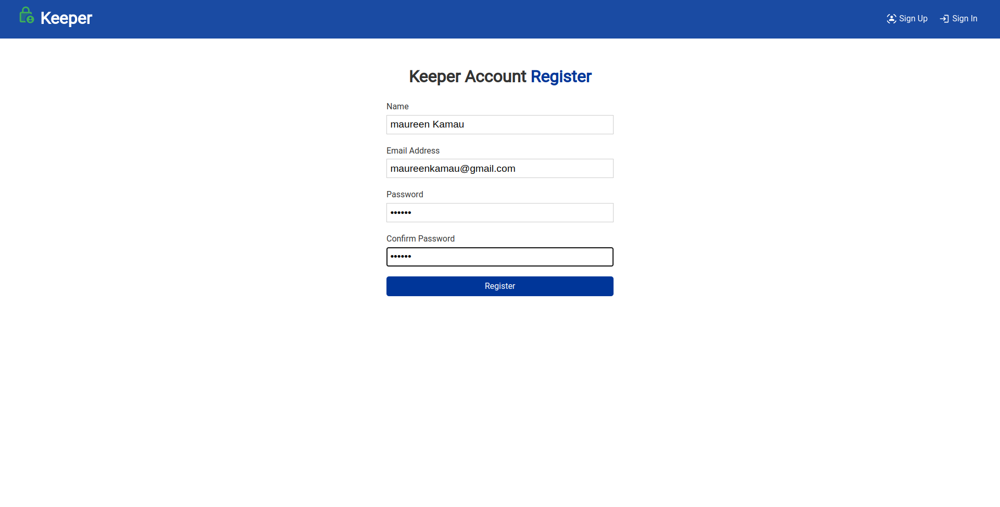
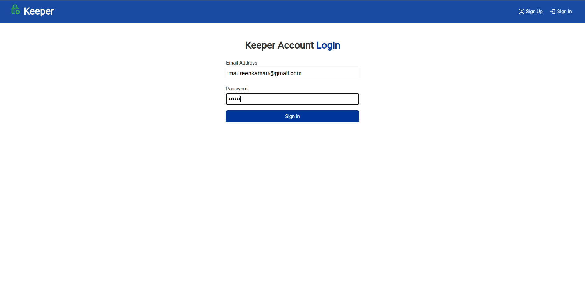
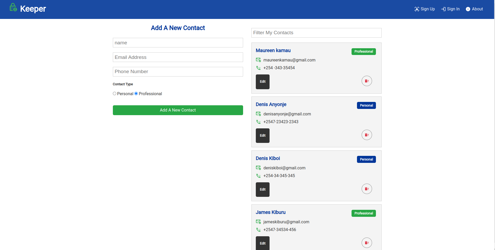
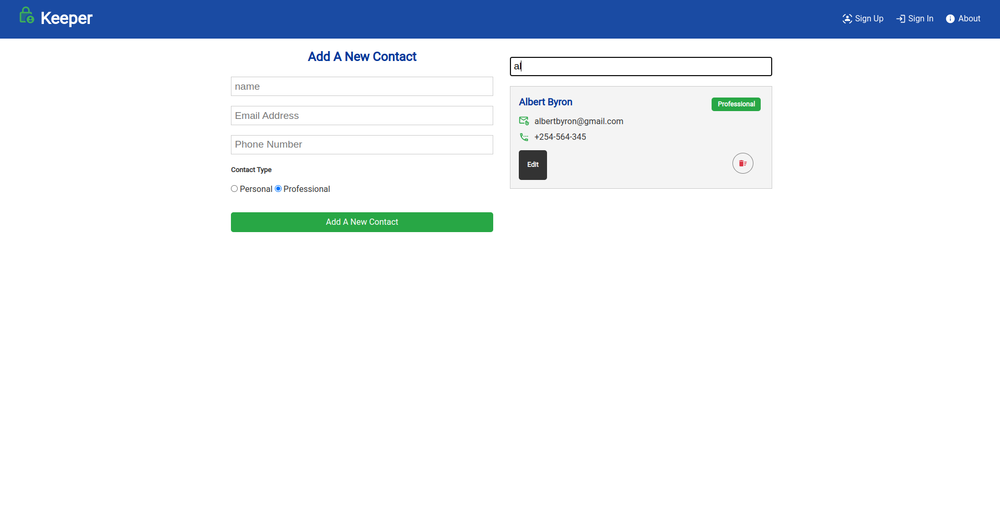
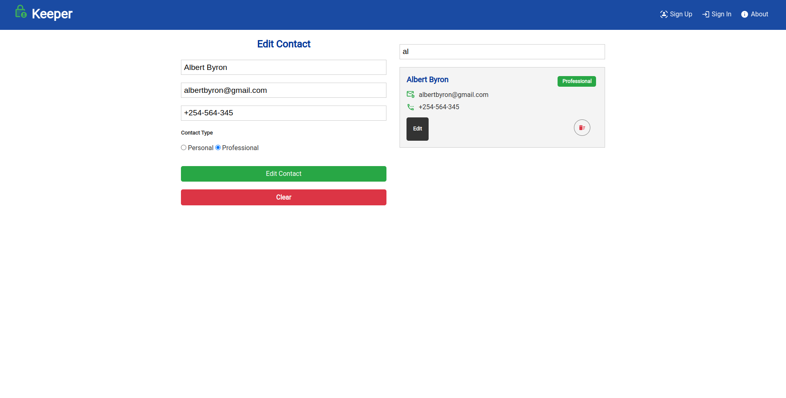

## About The Project

# Project Name

Keeper

## Authors Name

    Denis Ouma Otieno

## Table of contents

- [General info](#general-info)
- [Technologies](#technologies)
- [Setup](#setup)
- [contac](#contact)

## General info

The majority of cell phone users worldwide experience the issue of losing their contact lists due to either phone loss or phone damage, which is why Keeper is being created. Keeper is a free personal information manager that allows you to save all of your friends', families', and colleges' contact information in a single database file. With the built-in ability to login, update and delete, you'll never forget or loose your friends or professional contact number! since you can now access them from any device with an internet connection.

## How To Use The App

The Keeper can only be used by a user who has registered an account.

## How to Use the Website

### stem 1: To get to the page where you register an account, use the navigation in the page's upper left corner. When prompted, enter your credentials as needed and press Enter or click register button.

### step 3: If you already have an account, clicking the sign in button on the navbar will take you to a screen where you must enter both your email and password to access it. according to the picture below

### step 4: A form is provided where you may fill in the name, email, phone number, and choose if the contact is professional or personal. If you already have contacts created, they will be displayed as in the diagram when you log in.

### step 5: As seen in the images below, if you have more than 10 saved contacts, you can search for the person and also edit or delete a contact.

## Technologies

    Project is created with:

        - HTML - Is used to build the structure of the pages.
        - CSS - Is used to style the pages.
        - Reactjs - Is used to build the reactivity of the page and functionality.
        - Matrial-UI- Icons - the icons showed on the app are imported from material ui website.
        - JavaScript - Functionality of the website includes, click events and search.
        - Nodjs - The website API is built with Nodejs.
        - MongoDB - All the users data are saved on mongoDB cluster.

## Requirements

-Either a computer, Ipad, tablet or phone -An access to internet connection

## Program Setup

Clone or download the project from the Github repository to run it. In either a .env file add your database cluster address link. Inside the config folder default.json file to configure your database and connect to your cluster. both on the client folder and the backend root folder, install each of the packages required via npm install. Using concurrent technology, the frontend and the backend both run, and to start both servers, use the npm run dev command. on your terminal it will show Server started on port 5000 first then Morife is sucessfully running 🏃🏃🏃🏃 will dhow when the db is connected succesfully.

## Contact

    emain: dennisouma38@gmail.com

linkedin:
https://www.linkedin.com/in/denisouma/

## Live GitHub Pages Link

The webpage address:

https://safe-inlet-41111.herokuapp.com/login

## License information

[MIT](LICENCE)

Copyright (c) 2022 Denis Ouma Otieno
